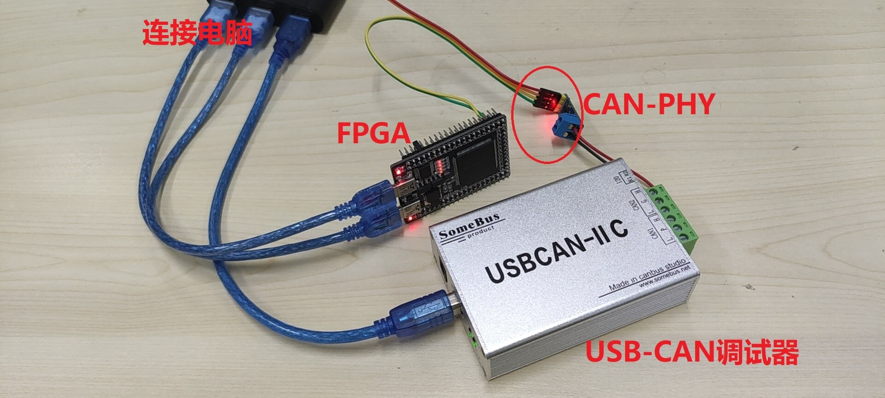
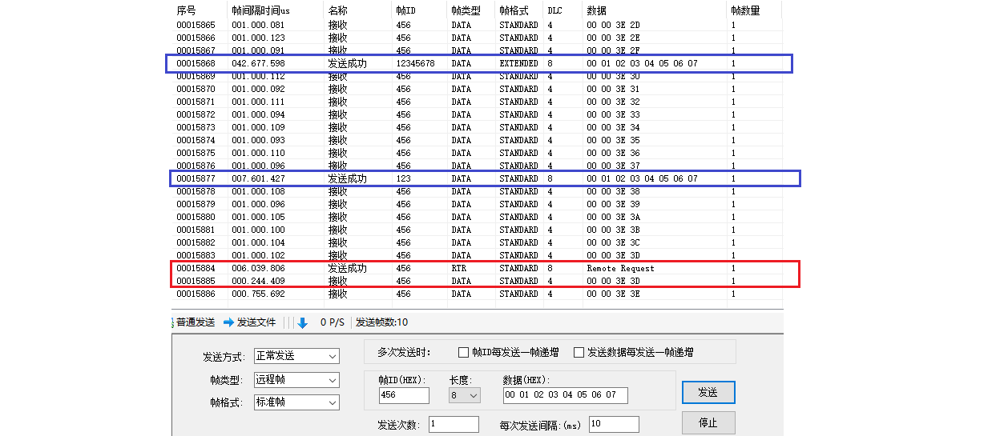

-CAD09D.svg)   

FPGA-liteCAN
===========================
基于 **FPGA** 的轻量级**CAN总线控制器**

# 简介

**CAN总线**作为工业和汽车领域最常用的通信总线，具有拓扑结构简洁、可靠性高、传输距离长等优点。

**CAN总线**的**非破坏性仲裁**机制依赖于**帧ID**，**CAN2.0A**和**CAN2.0B**分别规定了**11bit-ID(短ID)** 的**标准帧**和**29bit-ID(长ID)** 的**扩展帧**，另外，还有**远程帧**这种数据请求机制。关于CAN总线的更多知识可以参考[这个科普文章](https://zhuanlan.zhihu.com/p/32262127)。

**CAN总线**的复杂机制导致了**控制器**设计的复杂性。本库实现了一个**轻量化**但**完备**的**CAN控制器**，特点如下：

* **本地ID**可固定配置为任意**短ID**。
* **发送** : 仅支持以**本地ID**发送数据长度为**4Byte**的帧。
* **接收** : 支持接收**短ID**或**长ID**的帧，接收帧的数据长度没有限制 (即支持 **0~8Byte** ) 。
* **接收帧过滤** : 可针对**短ID**和**长ID**独立设置过滤器，只接收和过滤器匹配的数据帧。
* **自动响应远程帧** : 当收到的**远程帧**与**本地ID**匹配时，自动将发送缓存中的下一个数据发送出去。若缓存为空，则重复发送上次发过的数据。
* **平台无关** ：纯 RTL 编写 (SystemVerilog)，可以在 Altera 和 Xilinx 等各种 FPGA 上运行。

# 设计文件

RTL 文件夹包含3个设计代码文件，各文件功能如下表。你只需将这3个文件包含进工程，就可以调用顶层模块**can_top.sv**进行CAN通信业务的开发。

| 文件名 | 功能 | 备注 |
| :-- |   :-- |   :-- |
| **can_top.sv** | CAN控制器的顶层 |                               |
| **can_level_packet.sv** | 帧级控制器，负责解析或生成帧，并实现非破坏性仲裁 | 被**can_top.sv**调用 |
| **can_level_bit.sv** | 位级控制器，负责收发bit，具有抗频率偏移的下降沿对齐机制 | 被**can_level_packet.sv**调用 |

# 仿真文件

仿真相关的文件都在 SIM 文件夹中，其中：

- tb_can_top.sv 是针对 can_top.sv 的 testbench 。
- tb_can_top_run_iverilog.bat 包含了运行 iverilog 仿真的命令。

tb_can_top.sv 描述了4个CAN总线设备互相进行通信的场景，每个设备都是一个 can_top 的例化，**图1**是每个设备的详细属性，各个设备互相接收的关系可以画成左侧的图，箭头代表了各个设备之间的接收关系。另外，每个CAN设备的驱动时钟并不严格是50MHz，而是有不同的±1%的偏移，这是为了模拟更糟糕的实际情况下，CAN控制器的“自动对齐”机制能否奏效。

|        |
| :-----------------------------------: |
| **图1**：仿真中的4个CAN设备的详细参数 |

使用 iverilog 进行仿真前，需要安装 iverilog ，见：[iverilog_usage](https://github.com/WangXuan95/WangXuan95/blob/main/iverilog_usage/iverilog_usage.md)

然后双击 tb_can_top_run_iverilog.bat 运行仿真。仿真运行完后，可以打开生成的 dump.vcd 文件查看波形。

# 顶层模块说明

本节介绍如何使用 **can_top.sv** ，它的接口如下表。

| 接口名 | 方向 | 宽度 | 功能 | 备注 |
| :-- |   :--: |   :--: |    :-- |    :-- |  
| rstn | 输入 | 1 | 低电平复位 | 在开始工作前需要拉低复位一下 | 
| clk | 输入 | 1 | 驱动时钟 | 频率需要是CAN总线波特率的10倍以上，内部分频产生波特率 |
| can_rx | 输入 | 1 | CAN-PHY RX | 应通过FPGA的普通IO引出，接CAN-PHY芯片 (例如TJA1050) |
| can_tx | 输出 | 1 | CAN-PHY TX | 应通过FPGA的普通IO引出，接CAN-PHY芯片 (例如TJA1050) |
| tx_valid | 输入 | 1 | 发送有效 | 当=1时，若发送缓存未满(即tx_ready=1)，则tx_data被送入发送缓存 |
| tx_ready | 输出 | 1 | 发送就绪 | 当=1时，说明发送缓存未满。与 tx_valid 构成一对握手信号 |
| tx_data | 输入 | 32 | 发送数据 | 当tx_valid=1时需要同步给出待发送数据 tx_data |
| rx_valid | 输出 | 1 | 接收有效 | 当=1时，rx_data上产生1字节的有效接收数据 |
| rx_last | 输出 | 1 | 接收最后字节指示 | 当=1时，说明当前的rx_data是一个帧的最后一个数据字节 |
| rx_data | 输出 | 8 | 接收数据 | 当rx_valid=1时，rx_data上产生1字节的有效接收数据 |
| rx_id | 输出 | 29 | 接收ID | 指示当前接收帧的ID，若为短ID则低11bit有效 |
| rx_ide | 输出 | 1 | 接收ID类型 | =1 说明当前接收帧是长ID，否则为短ID |

## 接入CAN总线

**can_top.sv**的**can_rx**和**can_tx**接口需要引出到FPGA引脚上，并接CAN-PHY芯片（比如TJA1050），如**图2**。

|  |
| :--: |
| **图2**：接入CAN总线的方式 |

> 注：这里注意一个坑，虽然FPGA的引脚(can_rx,can_tx)可以是3.3V电平的，但CAN-PHY的电源必须是5V的，否则对CAN总线的驱动力不够。另外，CAN-PHY要和FPGA共地。

## 用户发送接口

**can_top.sv**的 **tx_valid**, **tx_ready**, **tx_data** 构成了类似 AXI-Stream 的流式输入接口，它们都与clk的上升沿对齐，用于向发送缓存中写入一个数据。只要发送缓冲区不为空，其中的数据会逐个被CAN控制器发送到CAN总线上。

**tx_valid** 和 **tx_ready** 是一对握手信号，波形如下图，只有当 **tx_valid** 和 **tx_ready** 都为1时，**tx_data** 才被写入缓存。**tx_ready**=0 说明缓存已满，此时即使 **tx_valid**=1 ，也无法写入缓存。不过，当发送频率不高而不至于让CAN总线达到饱和时，可以不用考虑缓存满（即**tx_ready**=0）的情况。

下图中，D0,D1,D2这3个数据被写入缓存，D0写入后，缓存已满，导致**tx_ready**=0，之后的3个周期D1都没有成功写入，但在第4个时钟周期**tx_ready**变成1，D1被写入。之后发送方主动空闲2个时钟周期后，D3也被写入。

每个数据都是4Byte(32bit)的，只要FIFO不为空，该CAN控制器就自动地每次发送一个帧，每帧一个数据，帧数据长度为4Byte。

              _    __    __    __    __    __    __    __    __    __    __    __
     clk       \__/  \__/  \__/  \__/  \__/  \__/  \__/  \__/  \__/  \__/  \__/  \
                          _____________________________             _____
    tx_valid  ___________/                             \___________/     \________
              _________________                   ________________________________
    tx_ready                   \_________________/
                          _____ _______________________             _____
    tx_data   XXXXXXXXXXXX__D0_X___________D1__________XXXXXXXXXXXXX__D3_XXXXXXXXX

## 用户接收接口

**can_top.sv**的 **rx_valid**, **rx_last**, **rx_data**, **rx_id**, **rx_ide** 构成了接收接口，它们都与clk的上升沿对齐。

当CAN总线上收到了一个与[ID过滤器](#配置ID过滤器)匹配的**数据帧**后，会将这一帧的字节逐个发送出来。设数据帧长为n字节，则**rx_valid**上会连续产生n个周期的高电平，同时**rx_data**上每拍时钟会产生一个收到的数据字节，在最后一拍会让**rx_last**=1，指示一帧的结束。在整个过程中，**rx_id**上出现该帧的ID（若为短ID，则只有低11bit有效），同时，**rx_ide**指示该帧为长ID还是短ID。

接收接口的波形图举例如下，该例中模块先后收到了一个短ID的，数据长度为4的数据帧，和一个长ID的，数据长度为2的数据帧。

                 __    __    __    __    __    __    __    __    __    __    __
     clk      __/  \__/  \__/  \__/  \__/  \__/  \__/  \__/  \__/  \__/  \__/  \_
                        _______________________             ___________
    rx_valid  _________/                       \___________/           \_________
                                          _____                   _____
    rx_last   ___________________________/     \_________________/     \_________
                        _____ _____ _____ _____             _____ _____
    rx_data   XXXXXXXXXX__0__X__1__X__2__X__3__XXXXXXXXXXXXX__0__X__1__XXXXXXXXXX
                        _______________________             ___________
    rx_id     XXXXXXXXXX__________ID1__________XXXXXXXXXXXXX____ID2____XXXXXXXXXX
                                                            _____________________
    rx_ide    _____________________________________________/

与发送接口不同，接收接口无握手机制，只要收到数据就让**rx_valid**=1来发出，不会等待接收方是否能接受。

## 配置本地ID

**can_top.sv** 有一个**11bit**的参数(parameter)叫 **LOCAL_ID**，它决定了该模块发送的帧的ID；同时，当**can_top**接收的**远程帧**的ID与**LOCAL_ID**匹配时，就会进行响应(ACK)，并自动回复一个**数据帧**（如果发送缓存为空，则自动重复回复上次发过的数据）。

## 配置ID过滤器

**can_top.sv** 的 **RX_ID_SHORT_FILTER** 和 **RX_ID_SHORT_MASK** 参数用来配置**短ID过滤器**。设收到的**数据帧**的ID是**rx_id**(短)，匹配表达式为：

    rx_id & RX_ID_SHORT_MASK == RX_ID_SHORT_FILTER & RX_ID_SHORT_MASK

以上表达式满足 Verilog 或 C 语言的语法。表达式为真时，**rx_id**与过滤器匹配，这样的**数据帧**才能被模块响应(ACK)，并将其数据转发到**用户接受接口**上。表达式为假时，**rx_id**与过滤器不匹配，该**数据帧**不仅不会被响应(ACK)，也不会被转发到**用户接受接口**上。

同理，**RX_ID_LONG_FILTER** 和 **RX_ID_LONG_MASK** 参数用来配置**长ID过滤器**。设收到的**数据帧**的ID是**rx_id**(长)，匹配表达式为：

    rx_id & RX_ID_LONG_MASK == RX_ID_LONG_FILTER & RX_ID_LONG_MASK

**MASK** 参数可以被称为**通配掩码**，掩码=1的位必须匹配 **FILTER** ，掩码=0的位我们不在乎，既可以匹配1也可以匹配0。

例如你想接收 0x122, 0x123, 0x1a2, 0x1a3 这4种**短ID**，则可配置为：

    RX_ID_SHORT_FILTER = 11'h122,
    RX_ID_SHORT_MASK   = 11'h17e

## 配置时序参数

**can_top.sv** 的 **default_c_PTS**, **default_c_PBS1**, **default_c_PBS2** 这3个时序参数决定了CAN总线上的一个位的3个段(PTS段, PBS1段, PBS2段)的默认长度，这3个段的含义详见[这个科普文章](https://zhuanlan.zhihu.com/p/32262127)。总的来说，分频系数计算如下：

    分频系数 = default_c_PTS + default_c_PBS1 + default_c_PBS2 + 1

而CAN总线的波特率计算方法为：

    CAN波特率 = clk频率 / 分频系数

例如，在 clk=**50MHz** 的情况下，可以使用如下参数组合来配置出各种常见的波特率。

| 分频系数 | 波特率 | default_c_PTS | default_c_PBS1 | default_c_PBS2 |
| :--:     | :-:| :-: | :-: | :-: |
|    50 | 1MHz  |  16'd34  |  16'd5  |  16'd10 |
|   100 | 500kHz |  16'd69  |  16'd10 |  16'd20 |
|   500 | 100kHz |  16'd349 |  16'd50 |  16'd100 |
|  5000 | 10kHz | 16'd3499 | 16'd500 |  16'd1000 |
| 10000 | 5kHz  | 16'd6999 | 16'd1000 | 16'd2000 |

# 示例程序

example-quartus 文件夹里是一个调用 **can_top.sv** 进行简单的**CAN通信**的案例，该工程使用 quartus 建立，并在 EP4CE6E22 FPGA 上运行（当然你也可以改改让它在自己的FPGA上运行）。

该案例每 1s 向 **can_top** 的发送缓存中送入一个递增的数据；同时，将CAN接收到的数据通过 UART 发送给电脑（不方便接UART可以不接，并不重要）。
**can_top** 的本地ID配置为 **0x456** ，ID过滤器被配置为只接收**短ID**=**0x123**或**长ID**=**0x12345678**的数据帧。

> 该案例中，CAN的波特率为1M，UART的波特率为115200

|  |
| :--: |
| **图3**：硬件连接 |

我在测试该例子时，将**FPGA**通过**CAN-PHY模块**与一台**USB-CAN调试器**相连，如**图3**。然后编译工程并下载FPGA。然后用**USB-CAN调试器**的配套软件，可以看到如下现象：

* 软件中每秒会收到一个 FPGA 发来的帧，数据长度DLC=4，值递增。如**图4**中没框的部分。
* 在软件中发送**短ID**=**0x123**或**长ID**=**0x12345678**的数据帧，会显示“发送成功”，如**图4**中蓝框的部分，说明该帧被 FPGA 响应了。同时，如果你把FPGA的UART连接到了电脑，在UART上可以看到打印出的数据内容。
* 在软件中发送**短ID**=**0x456**的远程帧，FPGA 会立即响应一个数据帧，如**图4**中红框的部分。

|  |
| :--: |
| **图4**：USB-CAN调试器的配套软件上观察到的现象 |
